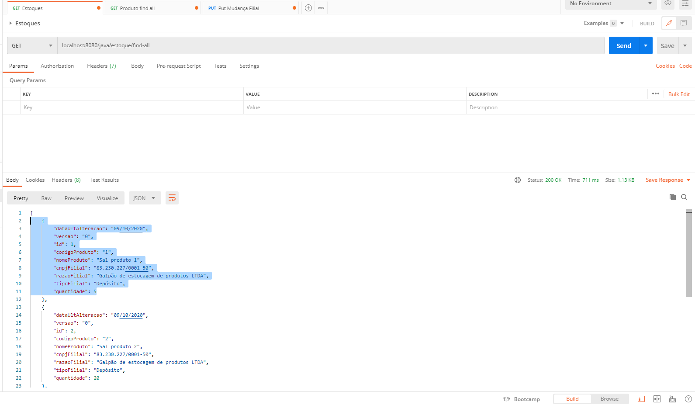
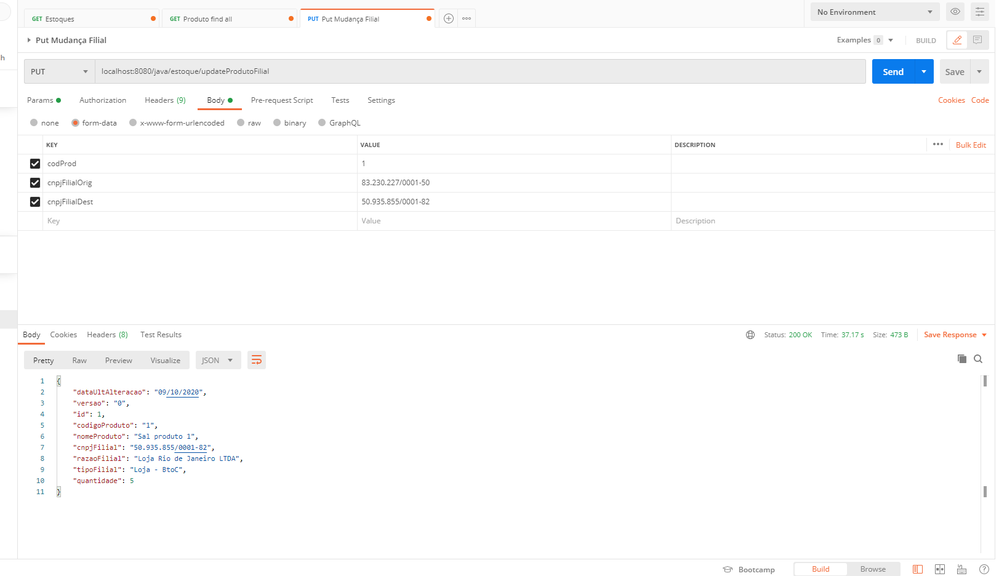
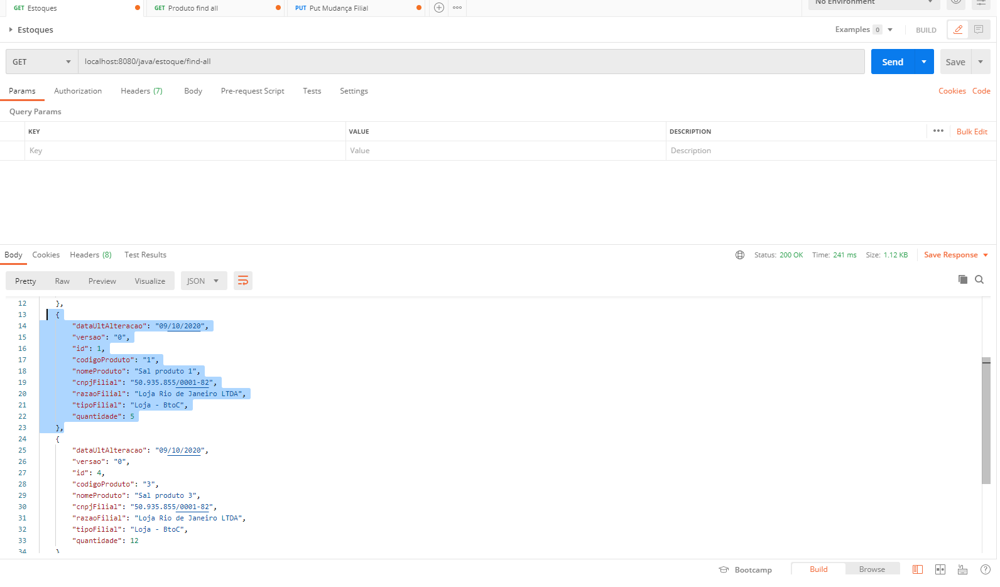
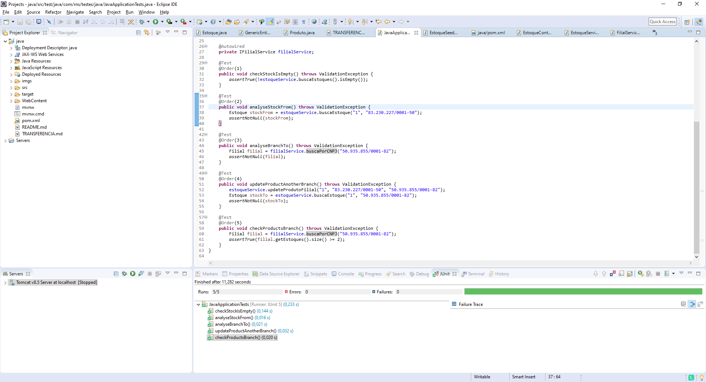

# Instruções de execução do projeto

## Preparação do ambiente
1. Realizar a importação do projeto como "Maven Project", criar o Tomcat 8.5 como server, adicionar o projeto dentro
	do server para que o deploy seja realizado.

## Feature de Estoque

1. Foi criada uma entidade "Estoque", responsável por armazenar os produtos de cada filial.
2. Na entidade estoque por sua vez temos a quantidade de produtos de cada filial.
3. Foi criado um DTO que retorna os dados de estoque, id do estoque, código e nome do produto, cnpj, razão social e tipo da filial,
	quantidade de um determinado produto para uma determinada filial, versão e data de atualização.
4. Foi criando um Seeder para o estoque, que faz a inserção dos registros, onde amarramos o produto à filial.
   Também foram criadas as classes (controller, serviço e dao).

## Retorno do método que busca todos os estoques
1. Foi criado um endpoint que retorna todos os estoques ordenados pela filial.
	O endpoint é o /estoque/find-all. Como a aplicação está rodando sob o tomcat
	porta 8080, a requisição GET ocorre na url localhost:8080/java/estoque/find-all.

2. Abaixo temos o retorno do JSON:

```json
[
    {
        "dataUltAlteracao": "09/10/2020",
        "versao": "0",
        "id": 1,
        "codigoProduto": "1",
        "nomeProduto": "Sal produto 1",
        "cnpjFilial": "83.230.227/0001-50",
        "razaoFilial": "Galpão de estocagem de produtos LTDA",
        "tipoFilial": "Depósito",
        "quantidade": 5
    },
    {
        "dataUltAlteracao": "09/10/2020",
        "versao": "0",
        "id": 2,
        "codigoProduto": "2",
        "nomeProduto": "Sal produto 2",
        "cnpjFilial": "83.230.227/0001-50",
        "razaoFilial": "Galpão de estocagem de produtos LTDA",
        "tipoFilial": "Depósito",
        "quantidade": 20
    },
    {
        "dataUltAlteracao": "09/10/2020",
        "versao": "0",
        "id": 4,
        "codigoProduto": "3",
        "nomeProduto": "Sal produto 3",
        "cnpjFilial": "50.935.855/0001-82",
        "razaoFilial": "Loja Rio de Janeiro LTDA",
        "tipoFilial": "Loja - BtoC",
        "quantidade": 12
    },
    {
        "dataUltAlteracao": "09/10/2020",
        "versao": "0",
        "id": 3,
        "codigoProduto": "1",
        "nomeProduto": "Sal produto 1",
        "cnpjFilial": "72.286.494/0001-23",
        "razaoFilial": "Loja São Paulo LTDA",
        "tipoFilial": "Loja - BtoC",
        "quantidade": 15
    }
]

```



## Transferência de produto de uma filial para outra
1. Tomando como base a empresa de CNPJ 83.230.227/0001-50, iremos transferir o produto "Sal produto 1" de código "1"
	para a outra empresa de CNPJ 50.935.855/0001-82.
2. O endpoint utilizado para realização da transferência é: localhost:8080/java/estoque/updateProdutoFilial.
3. Os parâmetros são enviados como form-data (@FormParam). 



Após a mudança o retorno Json da listagem de estoques demonstra a alteração de filial do produto "Sal produto 1".


```json

[
    {
        "dataUltAlteracao": "09/10/2020",
        "versao": "0",
        "id": 2,
        "codigoProduto": "2",
        "nomeProduto": "Sal produto 2",
        "cnpjFilial": "83.230.227/0001-50",
        "razaoFilial": "Galpão de estocagem de produtos LTDA",
        "tipoFilial": "Depósito",
        "quantidade": 20
    },
    {
        "dataUltAlteracao": "09/10/2020",
        "versao": "0",
        "id": 1,
        "codigoProduto": "1",
        "nomeProduto": "Sal produto 1",
        "cnpjFilial": "50.935.855/0001-82",
        "razaoFilial": "Loja Rio de Janeiro LTDA",
        "tipoFilial": "Loja - BtoC",
        "quantidade": 5
    },
    {
        "dataUltAlteracao": "09/10/2020",
        "versao": "0",
        "id": 4,
        "codigoProduto": "3",
        "nomeProduto": "Sal produto 3",
        "cnpjFilial": "50.935.855/0001-82",
        "razaoFilial": "Loja Rio de Janeiro LTDA",
        "tipoFilial": "Loja - BtoC",
        "quantidade": 12
    },
    {
        "dataUltAlteracao": "09/10/2020",
        "versao": "0",
        "id": 3,
        "codigoProduto": "1",
        "nomeProduto": "Sal produto 1",
        "cnpjFilial": "72.286.494/0001-23",
        "razaoFilial": "Loja São Paulo LTDA",
        "tipoFilial": "Loja - BtoC",
        "quantidade": 15
    }
]

```



## Teste unitário
1. Foram criados métodos dentro da classe de testes que representam as features de mudança do produto de uma
	filial para outra.


	

